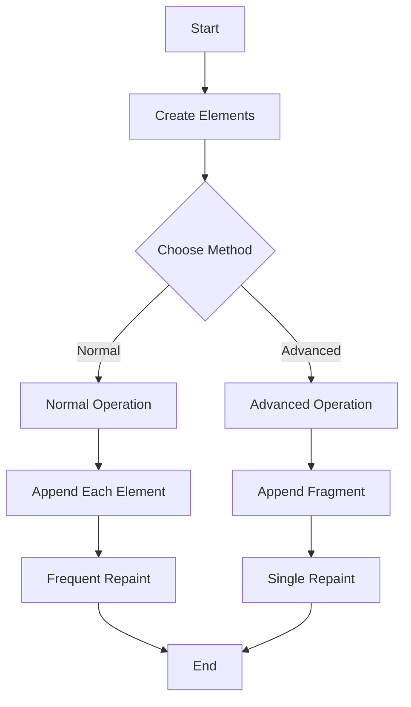

# Deep understand HTML DOM

## Add a large amount of DOM

**DocumentFragment** can be used.
This allows elements to be stored once in memory and displayed all at once, improving performance.

```mermaid
flowchart TB
    Start[Start] --> CreateElems[Create Elements]
    CreateElems --> ChooseMethod{Choose Method}
    ChooseMethod -->|Normal| Normal[Normal Operation]
    ChooseMethod -->|Advanced| Advanced[Advanced Operation]
    Normal --> AppendEach[Append Each Element]
    AppendEach --> RepaintN[Frequent Repaint]
    Advanced --> AppendFrag[Append Fragment]
    AppendFrag --> RepaintA[Single Repaint]
    RepaintN --> End[End]
    RepaintA --> End
```
