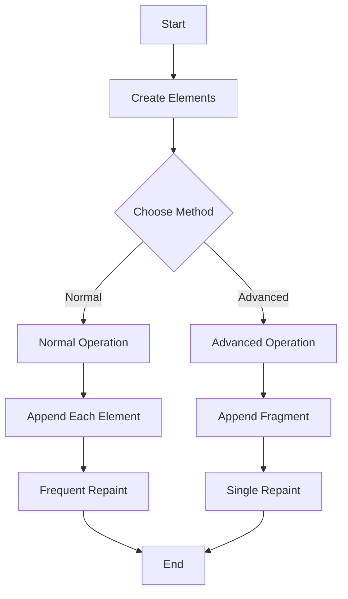
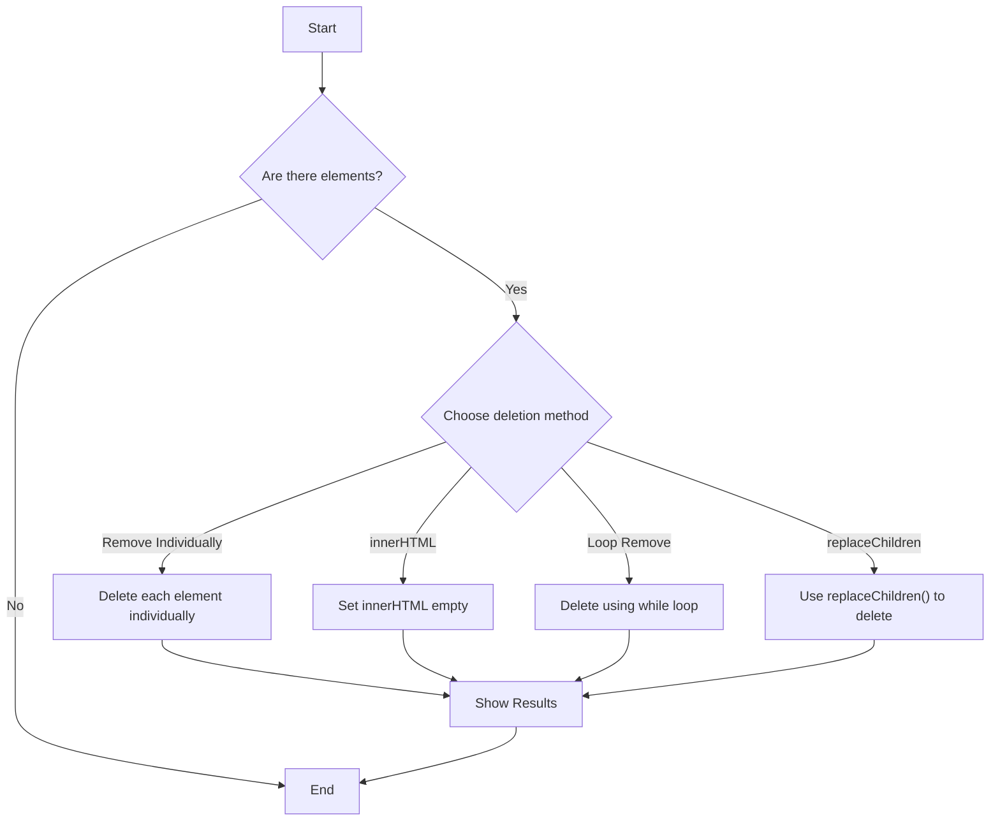
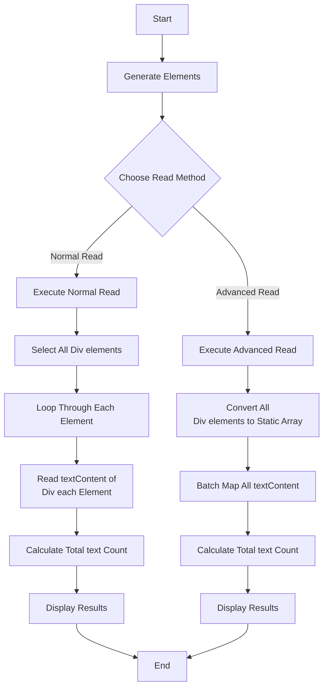

# Deep understand HTML DOM

## How it works

```bash
npm run dev
```

## Add a large amount of DOM

**DocumentFragment** can be used.
This allows elements to be stored once in memory and displayed all at once, improving performance.



## Delete a large amount of DOM

**ReplaceChildren** can be used.
Properly releases references to old nodes when deleting an existing child node and replacing it with a new child node
In addition, it is possible to delete them all at once.



## Read a large amount content textt of DOM


