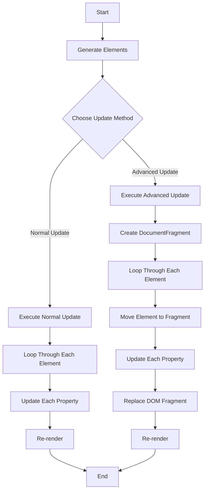

# Deep understand HTML DOM

## How it works

```bash
npm run dev
```

## Add a large amount of DOM

**DocumentFragment** can be used.
This allows elements to be stored once in memory and displayed all at once, improving performance.


## Delete a large amount of DOM

**ReplaceChildren** can be used.
Properly releases references to old nodes when deleting an existing child node and replacing it with a new child node
In addition, it is possible to delete them all at once.


## Read a large amount content text of DOM

**Map Reduce from JS API** can be used.
Map to get only TextContent of all elements and reduce to sum strings
This can be achieved by a combination of JS functions


## Update a large amount content text of DOM

Update operation requires changing the properties of each element.
Therefore, **normal functions** lead to better performance than DocumentFragment


